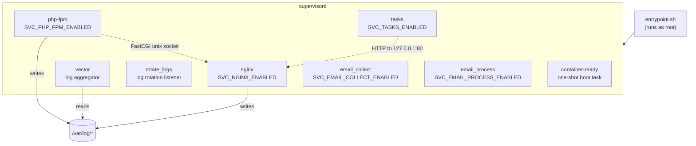

# Architecture overview

This document explains what lives inside the `deskpro/docker-product-base` image and how the pieces fit together. For the step-by-step sequence the entrypoint runs at container start, see [boot-flow.md](./boot-flow.md).

## What this image is

This is a **base image**, not a product image. It ships the runtime, system tooling, and Deskpro-specific scaffolding that the product image inherits. The Deskpro application code itself is layered on top in a separate repo and copied to `/srv/deskpro/`.

The image targets a single, opinionated deployment model: one container runs one or more long-lived services under supervisord, with configuration provided through environment variables and optional file mounts under `/deskpro/`.

## Layers

The [`Dockerfile`](../../Dockerfile) is multi-stage:

| Stage | Purpose |
| --- | --- |
| `builder-php-exts` | Compiles PHP PECL extensions (`protobuf`, `opentelemetry`) and installs the New Relic PHP agent. |
| `builder-go-binaries` | Downloads a pinned [gomplate](https://docs.gomplate.ca/) binary used for config templating at runtime. |
| `builder-security-packages` | Installs a set of commonly-CVE'd libraries (sqlite, expat, aom, zlib, tiff, webp, openjp2, curl) from Debian system repos. Kept as a stage for historical reasons and to make it easy to swap in custom-built versions later. |
| `stage1` | Debian 13.3-slim base, system packages, PHP 8.3 from [deb.sury.org](https://packages.sury.org/php/), nginx from the official nginx repo (pinned by version + verified GPG fingerprint). |
| `stage2` | Copies the PHP extensions and gomplate from the builder stages, plus `jq`, `composer`, `vector`, `node`, and `tsx` from their official images. |
| `build` | Final stage — copies Deskpro's own scripts, templates, and configs from `etc/`, `usr/local/bin/`, `usr/local/sbin/`, `usr/local/lib/`, `usr/local/share/deskpro/`, creates the `dp_app`, `vector`, and `nginx` users, sets ownership on log dirs, and wires up the `ENTRYPOINT` and `HEALTHCHECK`. |

## Runtime components

- **supervisord** is PID 1 under the entrypoint. It manages every long-lived process and kills the container if any service enters `FATAL` (unless `NO_SHUTDOWN_ON_ERROR=true`).
- **nginx** serves HTTP/HTTPS on ports 80, 443, 9080, 9443 (the `9xxx` ports terminate HAProxy PROXY protocol) and a status page on 10001. It proxies to PHP-FPM over unix sockets.
- **PHP-FPM** runs four pools out of the box — `dp_default`, `dp_broadcaster`, `dp_gql`, `dp_internal` — each with independently tunable process manager settings.
- **tasks** is a long-lived loop (`usr/local/sbin/tasksd`) that invokes `/srv/deskpro/bin/cron` every 20s. It writes run status to `/run/deskpro-cron-status.json` and honours a `PAUSE_CRON` sentinel file.
- **email_collect / email_process** are wrappers around the Deskpro email pipeline, with separate processes for fetching mail and processing queued messages.
- **vector** tails files under `/var/log/` and ships them either to stdout, a mounted directory, or CloudWatch depending on `LOGS_EXPORT_TARGET`.
- **container-ready** runs once at boot, waits for services to be up, and optionally runs the Deskpro installer or migrations (controlled by `AUTO_RUN_INSTALLER` / `AUTO_RUN_MIGRATIONS`).

Which services actually start is determined by the container's `CMD` argument. See [run-modes.md](../reference/run-modes.md).

## Configuration flow

Configuration enters the container through three channels:

1. **Environment variables** — the primary surface. Defined in [`container-var-reference.json`](../../usr/local/share/deskpro/container-var-reference.json). At boot, `10-container-config.sh` moves each var's value into a file under `/run/container-config/`, decodes any `_B64` / `_ESC` suffixed variants, and sets `*_FILE` pointers. Private vars are then stripped from the environment. This means `printenv` inside the container will not leak secrets — but `/run/container-config/` will contain them, with `1711` permissions.
2. **Template rendering** — `40-evaluate-configs.sh` runs `gomplate` over every `*.tmpl` under `/etc/{nginx,php,supervisor,vector}` and `/srv/deskpro/INSTANCE_DATA/deskpro-config.d/`. Templates can read container vars and the Deskpro site-info structure.
3. **Mounted files** — `20-custom-configs.sh` copies anything under `/deskpro/config/{nginx.d,php-fpm.d,php.d,vector.d,deskpro-config.d}` into the appropriate in-image location before templates render. This is the extension point for site operators.

See [configuration-flow.md](./configuration-flow.md) for the full picture.

## Where things live

| Path | Purpose |
| --- | --- |
| `/srv/deskpro/` | Deskpro application code (not in this image — layered in by the product image). |
| `/deskpro/` | The "custom mount basedir" — operators mount things here to inject configs, certs, and logs. Controlled by `CUSTOM_MOUNT_BASEDIR`. |
| `/run/container-config/` | Materialised env-var values, mode `1711`. Readable by `dp_app`. |
| `/run/container-*` | Boot sentinels (`container-ready`, `container-booted`, `container-running-installer`, `container-running-migrations`). |
| `/usr/local/bin/` | Operator-facing helper CLIs. See [helper-scripts.md](../reference/helper-scripts.md). |
| `/usr/local/sbin/` | Internal scripts — entrypoint, container-ready, tasksd. |
| `/usr/local/share/deskpro/` | Built-in templates, var reference JSON, test cert. |
| `/usr/local/lib/deskpro/` | Shared bash helpers sourced by other scripts. |
| `/var/log/{nginx,php,deskpro,supervisor,newrelic}/` | Log destinations. Owned by the relevant service user, group-writable for `adm` so vector can read them. |

## Relation to the product image

The product image (private) builds `FROM deskpro/docker-product-base:<version>` and adds:

- `/srv/deskpro/` — the actual application
- Composer dependencies and built frontend assets
- Product-image-level patches under `50-patches.sh` (if any)

The contract between this image and the product image is:

- The entrypoint and the set of supported `CMD` arguments are stable (see [run-modes.md](../reference/run-modes.md)).
- The env var reference is additive — existing vars' names, semantics, and defaults don't change between minor versions.
- The user layout (`dp_app`, `nginx`, `vector` UIDs) is stable.

Breaking any of these requires a major version bump.
