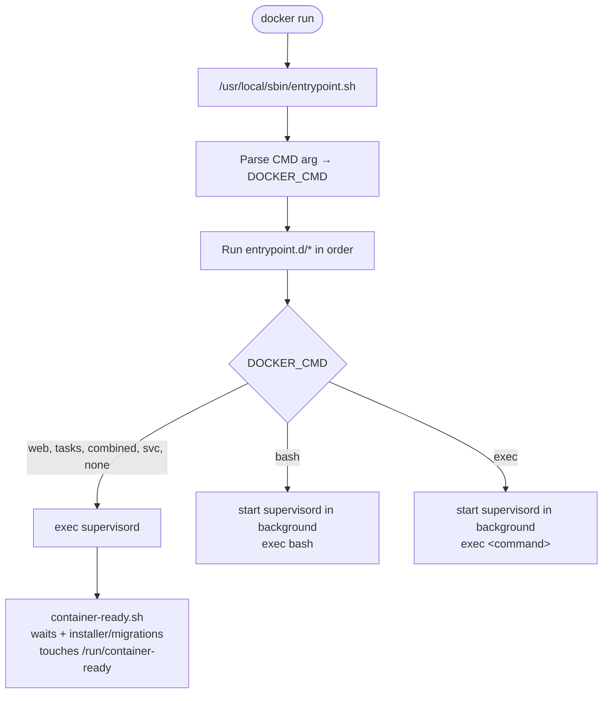

# Container boot flow

This document walks through exactly what happens from the moment `docker run` starts a container to the point where supervisord is accepting traffic. The goal is to give you a mental model you can use when debugging "why didn't my container start?" or "why is my env var not being read?"

If you only need a map, see [architecture.md](./architecture.md).

## High-level sequence

## What the entrypoint does, in order

The entrypoint is [`usr/local/sbin/entrypoint.sh`](../../usr/local/sbin/entrypoint.sh). It:

1. **Resolves the run mode.** The first argument to `docker run` becomes `DOCKER_CMD`. Defaults to `web` if unset.
2. **Seeds baseline environment** — `CONTAINER_NAME`, `LOGS_GID`, `BOOT_LOG_LEVEL`, and figures out whether logs should go to stdout or a directory (`LOGS_EXPORT_TARGET`, auto-detected from `LOGS_EXPORT_DIR` or the presence of `/deskpro/logs/`).
3. **Runs every script in [`usr/local/sbin/entrypoint.d/`](../../usr/local/sbin/entrypoint.d/) in alphabetical order.** These are the meat of boot — details below.
4. **Runs any operator-provided scripts** in `/deskpro/entrypoint.d/` (if mounted).
5. **Cleans sensitive environment variables** by calling `clean_env` from [`usr/local/lib/deskpro/`](../../usr/local/lib/deskpro/). Private vars (marked `isPrivate: true` in the reference JSON) get removed from the environment — their values live on in `/run/container-config/` and are read via `container-var`.
6. **Dispatches** on `DOCKER_CMD`:
   - `web`, `tasks`, `email_collect`, `email_process`, `combined`, `svc <names>`, `none` → `exec supervisord` as PID 1.
   - `bash` → start supervisord in the background, then `exec bash`.
   - `exec <cmd>` → start supervisord in the background, then `exec <cmd>`.

## The entrypoint.d scripts

| Script | What it does |
| --- | --- |
| `00-env.sh` | Creates log files with the right group ownership so vector can read them. Sets `VECTOR_MARKER` (used by vector to differentiate log streams). Initialises the cron status file. |
| `01-backwards-compat.sh` | Maps legacy env var names to their current equivalents and symlinks legacy `config.custom.php` locations for OPC-era deployments. |
| `05-opc.sh` | Sets reverse-proxy-header defaults for the OPC deployment model and extracts DB connection info from config formats when present. |
| `10-container-config.sh` | Materialises every env var in `container-var-reference.json` to `/run/container-config/<name>`. Handles `_B64` (base64), `_ESC` (escape sequence), and `_FILE` (path-to-secret) suffixes. Reads `/run/secrets/*` for Docker Swarm / Kubernetes secrets. |
| `15-run-mode.sh` | Reads `DOCKER_CMD` and sets `SVC_*_ENABLED=true` for the services that should start. Also auto-starts nginx + PHP-FPM if a task-style mode is going to call the localhost internal API. |
| `20-certs.sh` | Installs HTTPS certs from `/deskpro/ssl/`, syncs custom CA certs into the system trust store, wires up MySQL client certs. |
| `20-custom-configs.sh` | Copies operator-provided configs from `/deskpro/config/*.d/` into the in-image config directories, so the template step below sees them. |
| `40-evaluate-configs.sh` | Runs `gomplate` over every `*.tmpl` under `/etc/{nginx,php,supervisor,vector}` and the Deskpro config dir. This is when env vars become config values. |
| `41-deskpro-config.sh` | Renders `/usr/local/share/deskpro/templates/deskpro-config.php.tmpl` (or the file pointed to by `DESKPRO_CONFIG_FILE`) into `INSTANCE_DATA/` so the Deskpro app can load it. Applies `DESKPRO_CONFIG_RAW_PHP` and any `DESKPRO_CONFIG_EXTENSIONS`. |
| `50-patches.sh` | Applies runtime patches — typically empty in the base image; the product image layers its own patches on top. |
| `90-newrelic.sh` | If `DESKPRO_ENABLE_NEWRELIC=true`, configures the New Relic PHP agent. Otherwise leaves the extension loaded but inert. |

## The role of supervisord

Once supervisord starts, three things happen in parallel:

1. **vector** starts immediately. Its own logs (the only way to debug log shipping itself) go to stderr, wrapped by supervisor.
2. **container-ready** — the one-shot boot task — starts. It:
   - Polls `healthcheck` until services respond, or times out.
   - If `AUTO_RUN_INSTALLER=true` and the DB is empty, runs `/srv/deskpro/bin/install`.
   - If `AUTO_RUN_MIGRATIONS=true`, runs the migration artisan command.
   - Touches `/run/container-ready` to signal readiness to `is-ready` callers.
3. **The services named by `SVC_*_ENABLED`** start. Supervisord's autostart is driven by those env vars, so a service with `SVC_NGINX_ENABLED=false` exists in the config but doesn't run.

## Failure modes at each stage

| Symptom | Probable cause |
| --- | --- |
| Container exits instantly | A required env var (e.g., `DESKPRO_DB_HOST` when installer is on) isn't set. Check stderr for `container-var --required` failures from `10-container-config.sh`. |
| `nginx: [emerg] ... unknown directive` | A custom config under `/deskpro/config/nginx.d/` is broken, or a template in `/etc/nginx/` referenced a var that didn't exist. Re-run with `BOOT_LOG_LEVEL=DEBUG` to see the rendered config. |
| Healthcheck fails but nginx looks up | PHP-FPM pool didn't start. Check `/var/log/supervisor/php_fpm-stderr.log`. Usually a bad `PHP_INI_OVERRIDES` or a pool override that won't parse. |
| Container is "ready" but installer didn't run | `AUTO_RUN_INSTALLER` is only honoured on first boot (empty DB). If the DB has any Deskpro tables, the installer is skipped by design. |
| `email_collect` / `email_process` service flapping | These run under a timeout wrapper; a crash every `SVC_EMAIL_*_ARGS_MAX_TIME` seconds is the service restarting on purpose, not a fault. |

## Shutdown sequence

The container responds to SIGTERM by asking supervisord to stop all programs.

- `nginx` gets `QUIT` and waits up to 60s (0s if `FAST_SHUTDOWN=true` or `HTTP_INTERNAL_MODE=true`).
- `php-fpm` gets `TERM` and waits up to 60s.
- `tasks`, `email_collect`, `email_process` get `INT` then `TERM`, 30s grace.
- `vector` gets 8s (0s with `FAST_SHUTDOWN`).

If any service enters `FATAL` state mid-run, the `exit_on_failure` event listener kills the container. Set `NO_SHUTDOWN_ON_ERROR=true` to disable this — useful for `exec` / `bash` debugging, dangerous in production.
