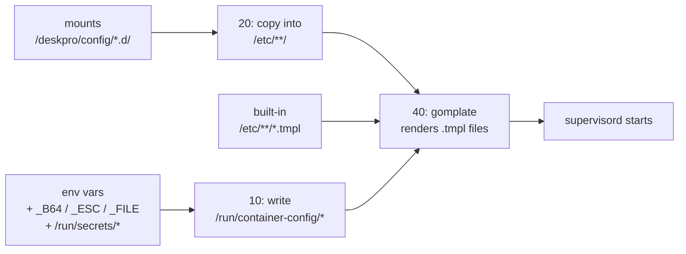

# How configuration reaches the application

Three channels feed configuration into this image: environment variables, templates, and mounted files. This doc explains how they combine — and, critically, in what order — so you can predict where a given setting will end up and why.

## The three channels

### 1. Environment variables

Environment variables are the primary input. The canonical list is [`usr/local/share/deskpro/container-var-reference.json`](../../usr/local/share/deskpro/container-var-reference.json). Each entry declares:

- `name` — the env var name
- `default` — the fallback if nothing is set
- `isPrivate` — if true, the var's value is moved to `/run/container-config/` and stripped from the process environment
- `setEnv` — if true, the var stays in the environment of every child process (needed for things PHP code or the Deskpro CLI will read via `getenv()`)

All three variant suffixes are supported on input:

- `<VAR>_B64` — base64-encoded; decoded at boot.
- `<VAR>_ESC` — shell-escape-sequence-encoded (`\n`, `\t`, etc.); unescaped at boot.
- `<VAR>_FILE` — path to a file containing the value. Anything under `/run/secrets/*` (Docker Swarm / Kubernetes secrets) is auto-detected and mapped to the equivalent `<VAR>_FILE`.

After `10-container-config.sh` runs, every variable has a file at `/run/container-config/<VAR>` and a `<VAR>_FILE` pointer. Scripts read values via the `container-var` CLI, which checks the env, then the file, then the default.

The full list is in [environment-variables.md](../reference/environment-variables.md).

### 2. Templates (gomplate)

Any file whose name ends in `.tmpl` under:

- `/etc/nginx/`
- `/etc/php/`
- `/etc/supervisor/`
- `/etc/vector/`
- `/srv/deskpro/INSTANCE_DATA/deskpro-config.d/`

is processed by [gomplate](https://docs.gomplate.ca/) in `40-evaluate-configs.sh`. The rendered file replaces the `.tmpl` source. Templates have access to:

- Environment variables (via `{{ .Env.VAR }}` or the `container-var` helper)
- The container's resolved site info (via the `site_info` data source, when applicable)
- Everything gomplate's standard library provides
- Two Deskpro-specific helper functions:
  - `php_string` — quotes and escapes a value for use as a PHP string literal.
  - `json_to_php` — parses a JSON string and emits it as a PHP value (objects become assoc arrays).

This is how `NGINX_WORKER_PROCESSES=4` ends up in the rendered `nginx.conf`, and how `PHP_FPM_DP_DEFAULT_MAX_CHILDREN=50` ends up in the `dp_default` pool config.

### 3. Mounted files

Operators inject their own settings by mounting files under `/deskpro/` (the "custom mount basedir", set by `CUSTOM_MOUNT_BASEDIR`). The entrypoint script `20-custom-configs.sh` copies them into the image's config directories *before* the template step runs, so operator files that are themselves `.tmpl` get rendered alongside the built-in ones.

The recognised subdirectories are:

| Mount | Copied into | Purpose |
| --- | --- | --- |
| `/deskpro/config/deskpro-config.d/` | `/srv/deskpro/INSTANCE_DATA/deskpro-config.d/` | PHP config snippets for the Deskpro app. |
| `/deskpro/config/nginx.d/` | `/etc/nginx/conf.d/` | Additional nginx server blocks or includes. |
| `/deskpro/config/php-fpm.d/` | `/etc/php/8.3/fpm/pool.d/` | Extra PHP-FPM pool configs. |
| `/deskpro/config/php.d/` | `/etc/php/8.3/cli/conf.d/` and `fpm/conf.d/` | Extra `php.ini` fragments. |
| `/deskpro/config/vector.d/` | `/etc/vector/vector.d/` | Extra vector sources/transforms/sinks. |
| `/deskpro/config/config.custom.php` | Symlinked into the Deskpro config dir | Legacy compatibility. |

Certificates follow a parallel convention under `/deskpro/ssl/` — see `20-certs.sh`.

## Order of application

The sequence matters:

1. Env vars are materialised **before** templates render — so a template can read them.
2. Mounted files are copied into place **before** templates render — so a mounted `.tmpl` gets processed, and a mounted literal config overrides or extends the image's defaults.
3. Built-in templates and mounted templates are rendered together in one gomplate pass, so there's no ordering between them — the last-written file wins. Because mounted files are copied in after built-ins, a mounted `nginx.d/50-custom.conf` sits alongside the built-in `conf.d/02-deskpro.conf`, not replacing it.

## Precedence for the Deskpro app config

The Deskpro application's PHP config is assembled by `41-deskpro-config.sh` from four sources, applied in this order:

1. The base template at `DESKPRO_CONFIG_FILE` (defaults to `/usr/local/share/deskpro/templates/deskpro-config.php.tmpl`).
2. Any files listed in `DESKPRO_CONFIG_EXTENSIONS` (colon-delimited paths).
3. All files in `/srv/deskpro/INSTANCE_DATA/deskpro-config.d/` (rendered if `.tmpl`).
4. Raw PHP from `DESKPRO_CONFIG_RAW_PHP`, appended at the end.

Later sources override earlier ones because they're appended to the same final PHP file and PHP reads top-to-bottom. Use `DESKPRO_CONFIG_RAW_PHP` as an escape hatch, not a primary configuration channel.

## Implications

- **Templates can see everything, but plain mounted files can't.** If you mount a literal `nginx.d/server.conf`, it's copied verbatim — it can't reference env vars. Use `.conf.tmpl` if you need substitution.
- **Private env vars aren't in `getenv()` at runtime.** Once `10-container-config.sh` runs, a `DESKPRO_DB_PASS` is gone from the process environment. Read it via `container-var DESKPRO_DB_PASS` or through the file pointer in `DESKPRO_DB_PASS_FILE`.
- **The template step is idempotent but not reactive.** If you change an env var after boot (e.g., by writing to `/proc/1/environ`), nothing re-renders. Restart the container to pick up config changes.
