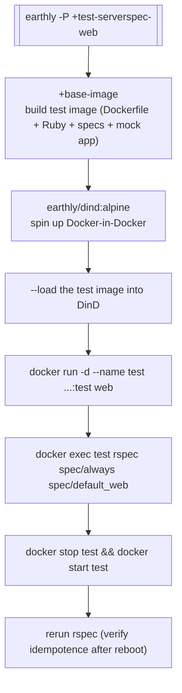

# How the test harness works

The harness has three moving parts: an [Earthfile](../../Earthfile) that orchestrates builds and runs, a [Serverspec](https://serverspec.org/) suite under [`serverspec/`](../../serverspec/) that makes assertions, and a mock PHP application under [`simulate-release/`](../../simulate-release/) that stands in for the real Deskpro product.

## Why this shape

The image being tested is a *base* image — the real product layers on top of it in a separate, private repo. Waiting on the product image for every commit would be slow and would couple this repo to another. So instead, we ship a tiny PHP stand-in that satisfies the contract the entrypoint expects (an installer binary, a migrations artisan command, a web index, a background service stub), and run the suite against that.

This means every assertion in the suite is about the *base image's* behaviour — how the entrypoint boots, how env vars propagate, how configs template, how services supervise, how logs flow. Anything product-specific is out of scope here.

## The pipeline

Every serverspec target follows the same shape. Scenarios that need specific setup (sentinel files, mounted directories, env vars) add those between `+base-image` and `docker run`; otherwise the structure is identical. See [reference/earthly-targets.md](../reference/earthly-targets.md) for the specifics of each target.

## The `+base-image` target

Defined in [`Earthfile`](../../Earthfile). It:

1. `FROM DOCKERFILE` — builds the repo's root `Dockerfile`, same as production.
2. Installs Ruby, bundler, serverspec, rake on top.
3. Copies [`serverspec/`](../../serverspec/) to `/test/serverspec` in the image.
4. Copies [`simulate-release/`](../../simulate-release/) to `/srv/deskpro` — the path the entrypoint expects the real app at.
5. Sets test-only env vars: `BOOT_LOG_LEVEL=TRACE` (see everything), `HTTP_USE_TESTING_CERTIFICATE=true` (skip the "you need a cert" step), `FAST_SHUTDOWN=true` (stop quickly between restarts).
6. Touches `/run/is-container-test` — a marker the image itself reads to know it's in test mode.
7. `bundler install` in `/test/serverspec/`.

Every test target inherits this image.

## The Serverspec suite

Serverspec is RSpec with a domain-specific library of resource matchers — `describe file(...)`, `describe user(...)`, `describe port(...)`, etc. It uses the `:exec` backend (set in [`spec_helper.rb`](../../serverspec/spec/spec_helper.rb)) which runs every command locally — inside the container, because that's where the specs are `docker exec`'d.

The suite is organised by lifetime, not by component:

- [`spec/always/`](../../serverspec/spec/always/) — invariants that must hold under every configuration. Users, critical paths, dependency versions. If one of these fails, the image is broken.
- [`spec/default_web/`](../../serverspec/spec/default_web/) — the default `web` run mode with no customisation. These and `spec/always/` run together in `+test-serverspec-web`.
- [`spec/cases/simple/`](../../serverspec/spec/cases/simple/) — single-feature cases, one file each, usually named after the Shortcut story they came from (e.g. `sc-130211-opentelemetry_spec.rb`).
- [`spec/scenarios/`](../../serverspec/spec/scenarios/) — multi-step behaviours that need an explicit Earthly target: auto-install, auto-migrations, custom configs, custom log groups, OPC backward-compat.

## The mock app

[`simulate-release/sim.php`](../../simulate-release/sim.php) implements just enough of the Deskpro application surface for tests to exercise the base image:

| Endpoint / command | Simulates | Typical use |
| --- | --- | --- |
| `GET /` | Main web | Proves nginx + FPM + wire-up work. |
| `GET /phpinfo` | Diagnostic | Inspecting what PHP settings actually took effect. |
| `GET /api/v2/helpdesk/discover` | Healthcheck API | Used by `healthcheck --test-discover`. |
| `GET /dump-config` | Config inspection | Tests that render `INSTANCE_DATA/config.php` correctly. |
| `bin/install` | Installer CLI | Auto-installer scenario. |
| `tools/migrations/artisan migrations:{status,exec}` | Migrations | Auto-migrations scenario. |
| `tools/fixtures/artisan install` | Fixtures install | Test-bootstrap path. |
| `services/messenger-api/bin/start` | Dummy long-lived service | Supervisor-management tests. |

State is faked by the presence or absence of sentinel files under `/run/sim/` — a test mounts the right sentinel for the scenario it wants (e.g. `/run/sim/needs-installer` to make `migrations:status` return "empty DB").

## Why containers restart mid-test

Most targets run the same spec suite twice, separated by `docker stop && docker start`. This catches bugs where something only works on first boot (e.g. the installer running a second time, or migrations thinking they still need to execute). Idempotence is load-bearing for production deployments, so it's load-bearing for the tests.

## Trade-offs

- **The mock is a fiction.** Anything that depends on real app behaviour is untestable here. This is by design — product-level tests live in the product repo.
- **Serverspec is synchronous.** Long-running assertions (e.g. "wait until logs show X") use the `is-ready` / `healthcheck` helpers rather than polling from within the spec. If a spec is racy, check that it's not missing a `before(:all)` readiness wait.
- **Earthly targets are deliberately coarse.** Each target spins up its own container. Fine-grained targets would be faster in isolation but slower overall because each would re-run `+base-image` cache misses. The current structure batches specs by "same container setup".
